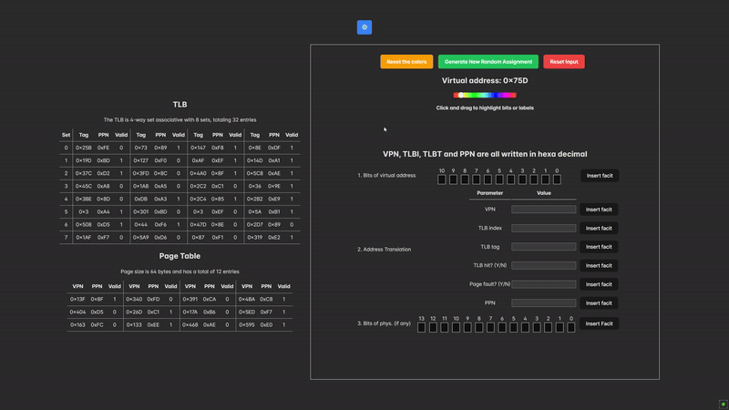

# VMAT - Virtual Memory Address Translation

> [!NOTE] 
> The vision is to create a platform with exercises and
> interactive diagrams suited for CompSys students that
> make it visually appealing and engaging to learn.

  

An **interactive learning simulator** for **Computer Systemer** students to explore **virtual memory address translation** through simulations and exercises. 
This simulator was created by [Nidocq](https://github.com/Nidocq) and I

## Features
- **Exam Digitalization:** The simulator digitally recreates computer systems exams, allowing students to practice virtual memory address translation in a controlled environment.
- **Configurability:** The project offers configurability, enabling students to experiment with various types of assignments. This flexibility allows users to customize parameters such as page size, number of pages, and different memory management schemes.
- **Interactive Learning:** With a user-friendly interface, the simulator promotes interactive learning by visualizing the virtual memory address translation process step by step. Students can observe how different configurations impact the translation and gain a deeper understanding of the underlying concepts.

## **Getting Started**
Clone the repository and install dependencies:
```sh
git clone https://github.com/MahmoodSeoud/cache-hit-miss.git  
cd cache-hit-miss  
npm install  
npm run dev  
```

### VMAT vs Exam
  
vs


---
## **Project Report**

<a href="./assets/Virksomhedsprojekt_2023.pdf" download>
    <button>Get Project Report</button>
</a>


